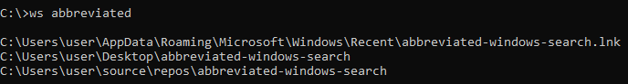

abbreviated-windows-search
========
A command-line file search utility for Windows.

Installation
--------
With Visual Studio installed, you can run:

	vcvarsall.bat x64

Then compile with:

	cl /ZI main.cpp sqlite3.c Shell32.lib /Fe:ws.exe

Finally, add the executable to your PATH.

Usage
--------
First, run `ws` without any arguments to create an index of system files.

	ws

Then run `ws` with a filename to find where a file might be. Note that the filename doesn't have to be an exact match.

	ws <filename>